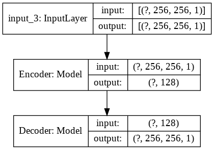
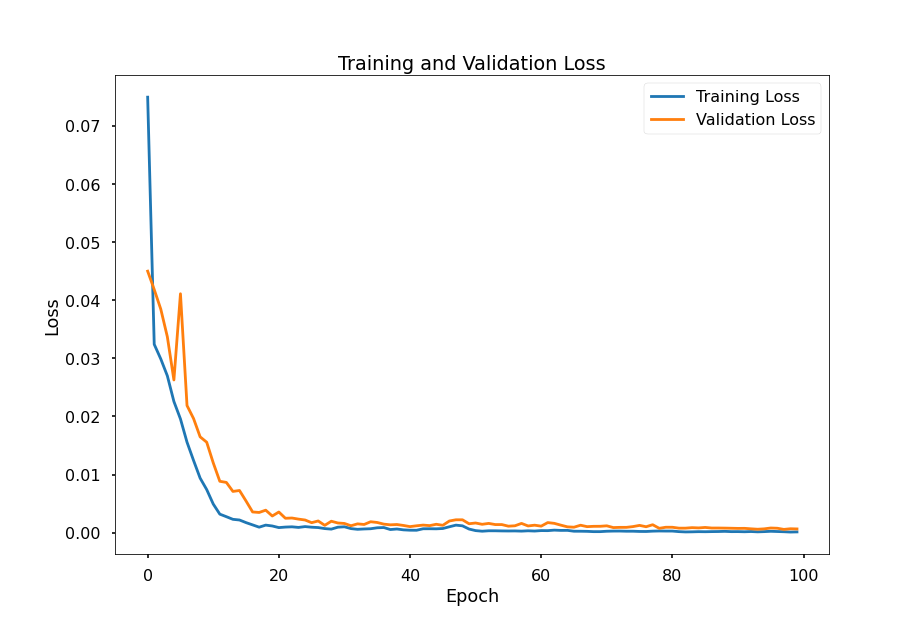

# Denoising Dirty Documents

Source: https://www.kaggle.com/c/denoising-dirty-documents/data

## Model
Latent Dims: 128
Filters: (64,128)

### Training
Model is trained for 100 Epochs with a Batch-Size of 1.

