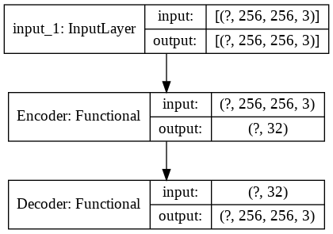
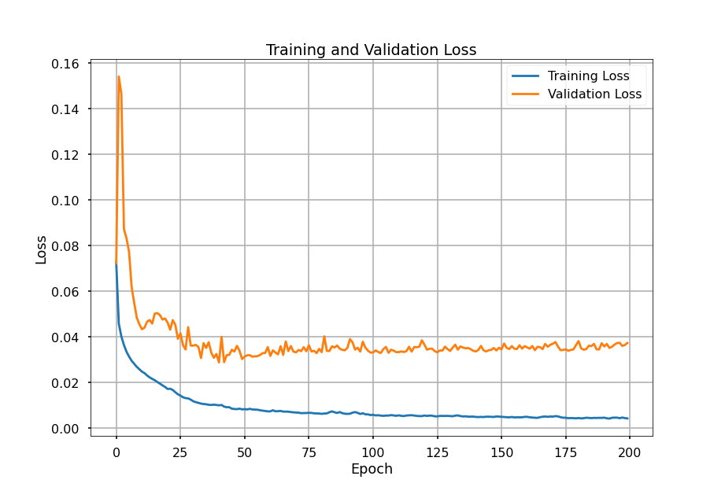
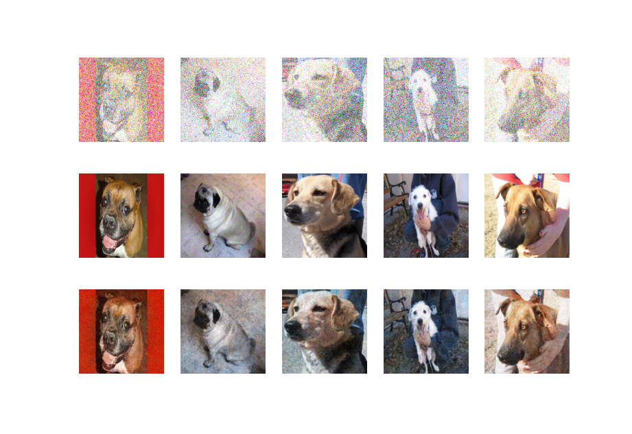

# Denoising Images

Dataset: https://storage.googleapis.com/mledu-datasets/cats_and_dogs_filtered.zip

## Model
Image Dims: (256,256,3)
Latent Dims: 32
Filters: (32,64)

### Training
Model is trained for 150 Epochs with a Batch-Size of 64.

### Results
1st Row contains Images passed to Model as Input, 2nd Row Images are Targets for corresponding Inputs and 3rd Row contains Images that are Predicted by the Model.\

