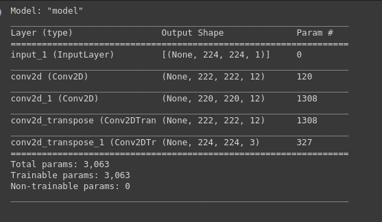
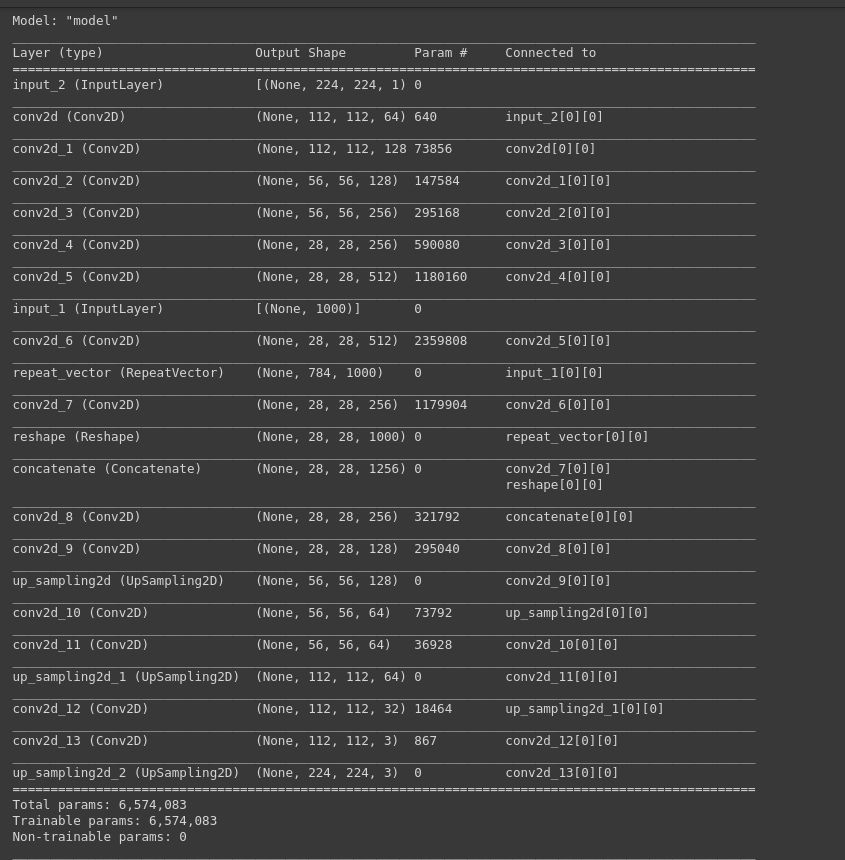

# Image Colorization
Converting a Gray-Scale Image to RGB Image using Deep Learning.

### Source of Dataset : http://places.csail.mit.edu/

Due to Computational Challenges(Total Size of Dataset is 2.3GB(in .zip format)), only a part of the Dataset is used to train the Deep Learning Model.

The folowing is an another dataset from Kaggle.

### Source of Dataset : https://www.kaggle.com/shravankumar9892/image-colorization

Due to Computational Challenges(Total Size of Dataset is 3.8 GB), only a part of the Dataset is used to train the Deep Learning Model.

### Research Paper: https://arxiv.org/pdf/1712.03400.pdf

### Model-1:

Model-1 can be found in Image_Colorization.ipynb

### Model-2:

Model-2 can be found in Image_Colorization_Inspired_from_Research_Paper.ipynb. The following Model is modified version of Model in Research Paper.

### Model-3:

Model-3 can be found in Image_Colorization_Inspired_from_Research_Paper.ipynb. The following Model is in Research Paper.

### Computations

It is mentioned in Research Paper that they trained their Model for 60,000 Images from ImageNet Dataset in which 10% of it is used to Vaidate the Model and Model took almost 23 Hours to train. In our case, all the 3 Models are trained for 20-30 Epochs on Image Data containing 4,556 Images due to computational limitations. It is suggested to train the model on a good GPU resourceful platform with good amount of RAM.
