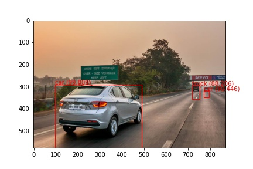
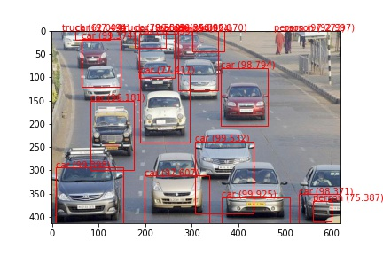
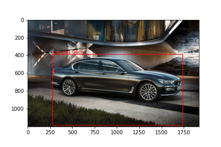
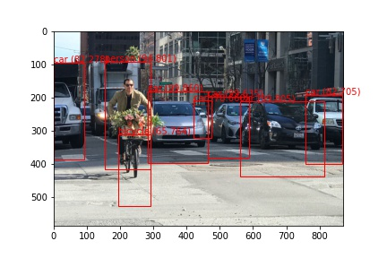
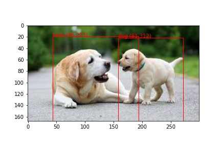
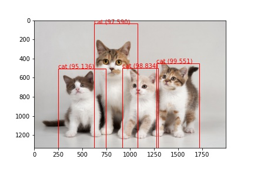

# Learning Object Detection

Learning Implemetation of YOLOV3 for Object Detection.Sources of Data are attached in Python Notebook.

## Details of Model
The output of the model is, in fact, encoded candidate bounding boxes from three different grid sizes, and the boxes are defined the context of anchor boxes, carefully chosen based on an analysis of the size of objects in the MSCOCO dataset.

Output for a Image of input is as follows
```
[(1, 13, 13, 255), (1, 26, 26, 255), (1, 52, 52, 255)]
```

Anchors, Thresholds and Labels
```
Anchors = [[116,90, 156,198, 373,326], [30,61,62,45, 59,119], [10,13, 16,30, 33,23]]
Class_Threshold = 0.6
IOU_Threshold = 0.5
Labels = ["person", "bicycle", "car", "motorbike", "aeroplane", "bus", "train", "truck", "boat", "traffic light",
"fire hydrant", "stop sign", "parking meter", "bench", "bird", "cat", "dog", "horse", "sheep", "cow", "elephant", "bear",
"zebra", "giraffe", "backpack", "umbrella", "handbag", "tie", "suitcase", "frisbee", "skis", "snowboard", "sports ball",
"kite", "baseball bat", "baseball glove", "skateboard", "surfboard", "tennis racket", "bottle", "wine glass", "cup",
"fork", "knife", "spoon", "bowl", "banana", "apple", "sandwich", "orange", "broccoli", "carrot", "hot dog", "pizza",
"donut", "cake", "chair", "sofa", "pottedplant", "bed", "diningtable", "toilet", "tvmonitor", "laptop", "mouse",
"remote", "keyboard", "cell phone", "microwave", "oven", "toaster", "sink", "refrigerator", "book", "clock", "vase",
"scissors", "teddy bear", "hair drier", "toothbrush"]
```

## Results






