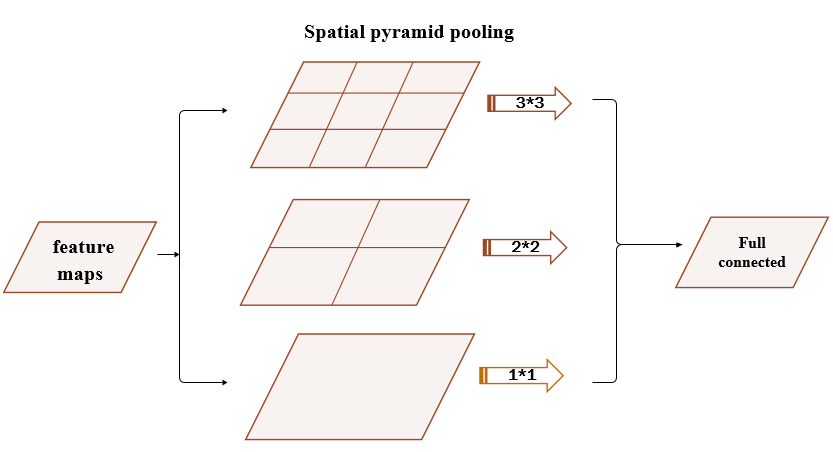
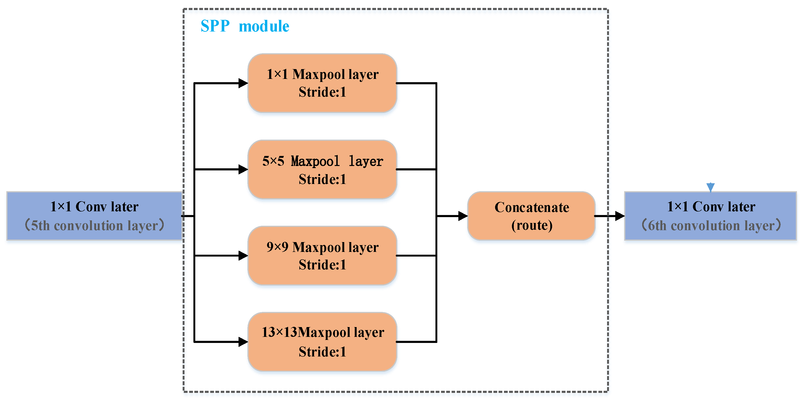
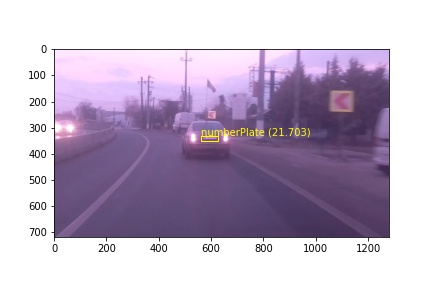
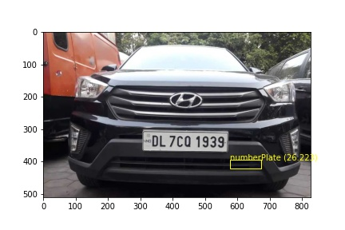
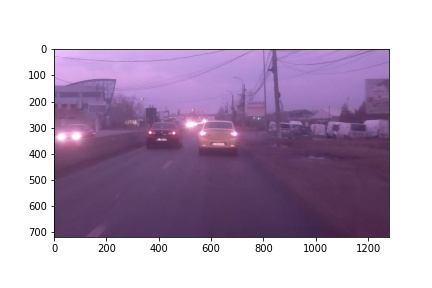
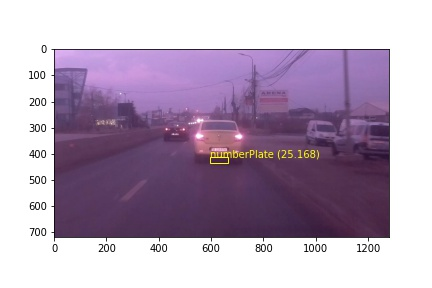

# License Plate Detection

Implementation of License Plate Detection using YOLOV3-SPP (YOLOV3 with Spatial Pyramid Pooling).

Source of Dataset: [license-plate-detection](https://github.com/RobertLucian/license-plate-dataset) \
Source of Reference: [Research Paper for YOLOv3-SPP](https://arxiv.org/pdf/1907.11093.pdf)

## Spatial Pyramid Pooling
Model is tested with **Keras Implementation of YOLOV3-SPP**.

#### Example:


#### SPP in YOLOv-spp


## Data-Preparation
We will be dealing with images of dimensions (416 X 416 X 3). Run the python script **resize-image.py**

## Training the Model
Source of Learning Transfer Learning on YoloV3: [Transfer Learning](https://github.com/ultralytics/yolov3/wiki/Train-Custom-Data)

The folder **yolov3** is created by cloning the GitHub Repository [https://github.com/ultralytics/yolov3](https://github.com/ultralytics/yolov3)

**Framework**: PyTorch \
**Model**: YOLOV-SPP

Due to insufficiency in GPU Resources, Model is trained with all Training Images but with only one Validation Image for 300-320 epochs. But, the Model Performance is fairly Good.

### Steps:
1. Copying license-plate-dataset folder to yolov3 folder.
2. Copying Model_Data/train_images.txt to the folder yolo/data
3. Copying Model_Data/valid_images.txt to the folder yolo/data
4. Copying Model_Data/model.names to the folder yolo/data
5. Copying Model_Data/model.data to the folder yolo/data
6. Changing model.cfg file.
7. Change to yolov3 directory where we can find the python script **train.py**. Run the following command to train the model
    ```
    python3 train.py --data data/model.data --weights weights/yolov3-spp-ultralytics.pt
    ```
    Implementation in Python Notebook **License Plate Detection PyTorch Running.ipynb** in yolov3 folder and the notebook  **tutorial.ipynb** is for tutorial.
8. Inorder to convert PyTorch Weights to TensorFlow Weights check the link: [Reference](https://github.com/ultralytics/yolov3#darknet-conversion)

### Results of Training


## Testing the Model
**Framework**: TensorFlow,Keras \
**Model**: YOLOv3-SPP (Keras-Implementation) \
**No.of Layers of Model**: 261

Code is in **License Plate Detection** along with Implementation of YOLOv3-SPP with Keras. Use the weights created the **License Plate Detection PyTorch Running.ipynb**.
### Results

